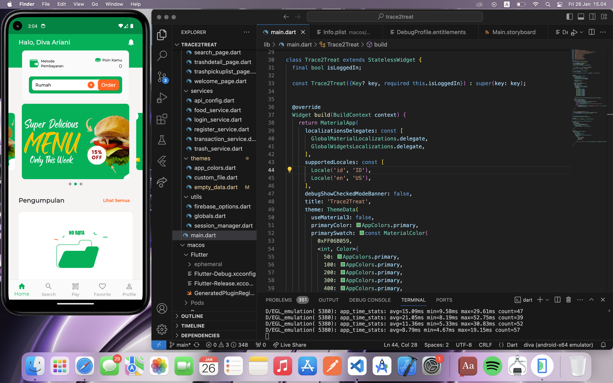

# TRACETOTREAT APP (MOBILE)

Trace2Treat adalah platform promosi produk makanan belum terjual yang menawarkan solusi bagi dua masalah serius: food waste dan sampah plastik. Melalui kolaborasi dengan pelaku UMKM di bidang makanan, kami menghadirkan solusi yang menggabungkan keberlanjutan dan aksesibilitas. Trace2Treat memberikan solusi pengelolaan sampah yang berkelanjutan dengan melibatkan pelaku UMKM sebagai mitra utama. Dengan Trace2Treat customer memiliki kemudahan untuk mengakses makanan dengan harga terjangkau. Pelanggan dapat membayar dengan uang tunai atau e-money dan tukar sampah plastik. Ketika pelanggan memesan makanan, driver Trace2Treat juga akan mengambil sampah plastik yang telah dipisahkan oleh pelanggan. Sampah plastik ini kemudian diolah dan didaur ulang oleh pengepul mitra. Fokus bisnis Trace2Treat adalah memenuhi kebutuhan pekerja dan mahasiswa perkotaan dengan makanan yang memiliki harga terjangkau dengan konsep bisnis ramah lingkungan. Melalui aplikasi pengiriman makanan yang efisien, Trace2Treat menyediakan solusi yang nyaman, hemat biaya, dan berkelanjutan.

## ERD Aplikasi

## POSTMAN Documentation App 
[Documentation](https://documenter.getpostman.com/view/15380804/2s9YsMBBqX)
 

## Response Example Backend

## MOBILE 
- run `flutter pub get`
- run `flutter run`

## WEB
- run `composer update`
- create a new env from .env.example
- run `php artisan migrate`
- run `php artisan optimize`
- run `php artisan config:clear`
- run `php artisan serve`
