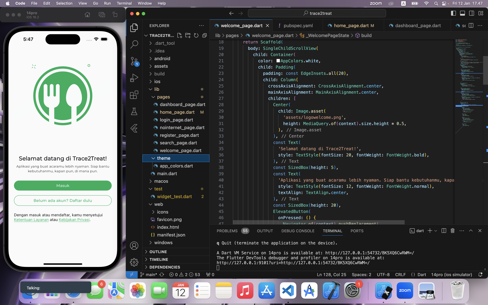
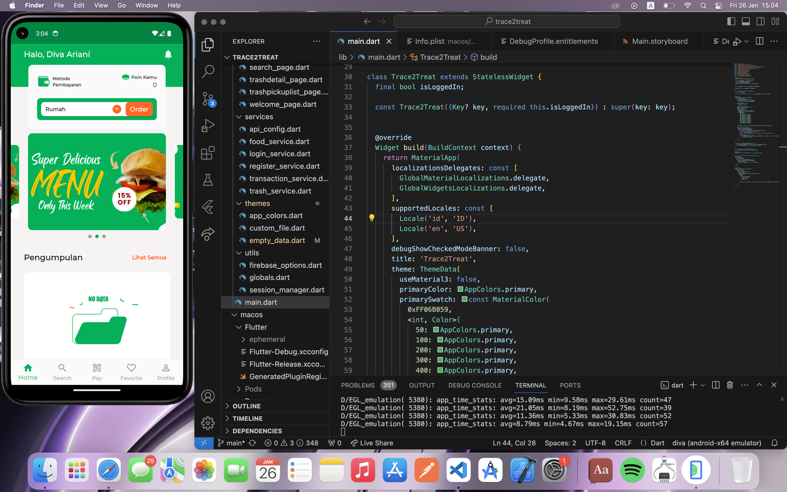
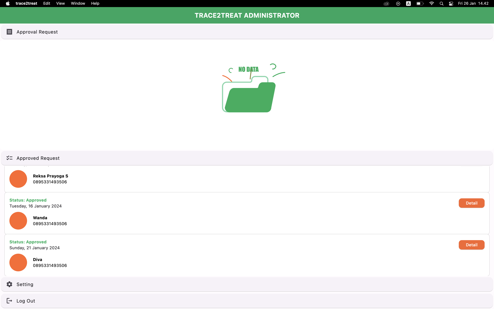
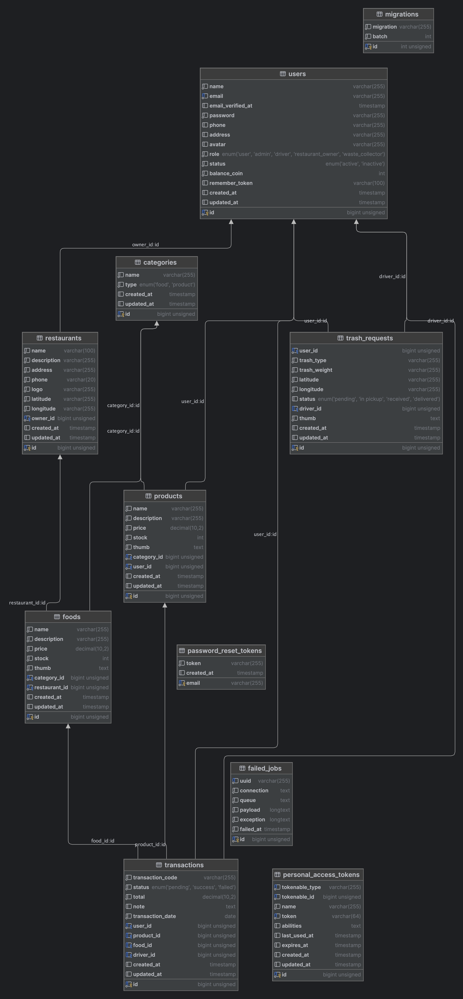
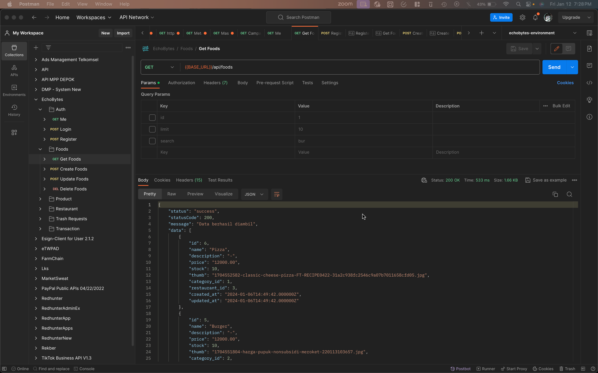

# Team Name
Kiddovation

# Team Members
1. Diva Ariani (Hacker)
2. Reksa Prayoga Syahputra (Hacker)
3. Muhammad Rafi (Hipster)
4. Muhammad Rizki Agus Salim (Hustler)

# TRACE2TREAT (trash to treat)
Trace2Treat is a platform for promoting unsold food products that offers solutions to two serious problems: food waste and plastic waste. Through collaboration with small and medium-sized enterprises (UMKM) in the food industry, we provide a solution that combines sustainability and accessibility. Trace2Treat offers a sustainable waste management solution by involving UMKM players as main partners. With Trace2Treat, customers have the convenience of accessing affordable food. Customers can pay with point from exchange plastic waste. When customers order food, Trace2Treat drivers also collect plastic waste that has been separated by customers. This plastic waste will processed and recycled by partner collectors. Trace2Treat's business focus is to meet the needs of urban workers and students with affordable, environmentally friendly food concepts. Through an efficient food delivery application, Trace2Treat provides a convenient, cost-effective, and sustainable solution.

## ERD Aplikasi

## POSTMAN Documentation App 
[Documentation](https://documenter.getpostman.com/view/15380804/2s9YsMBBqX)
 

## Response Example Backend

## MOBILE 
- run `flutter pub get`
- run `flutter run`

## WEB
- run `composer update`
- create a new env from .env.example
- run `php artisan migrate`
- run `php artisan optimize`
- run `php artisan config:clear`
- run `php artisan serve`
